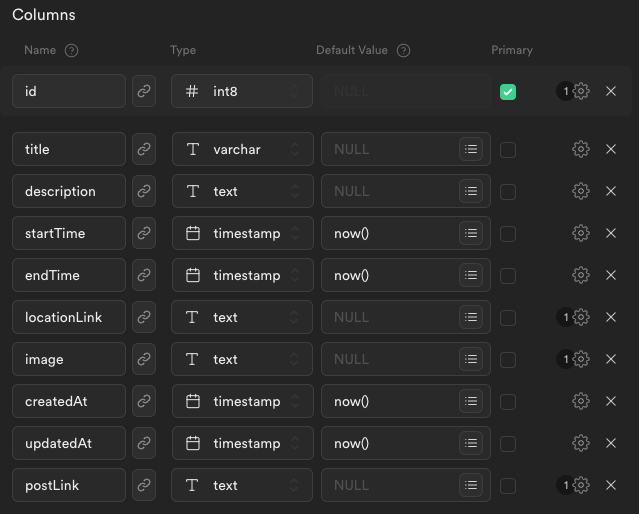

# 🤖 OPBOT-2

OPBOT-v2 is a second-generation Discord bot written in typescript and designed to be used for the UNSW One Piece Society.
It seeks to be an improvement over the v1 bot and contains multiple features that are specially designed to automate processes related to updating/posting events and collecting user information.

## 📕 Current Features

- [ ] API database management tool
- [X] Automated discord message scheduler and posting system

### Feature Info

#### Table schema used

#### Usage of location links

A detailed guide on obtaining image link can be found here: <https://support.google.com/maps/answer/144361>
